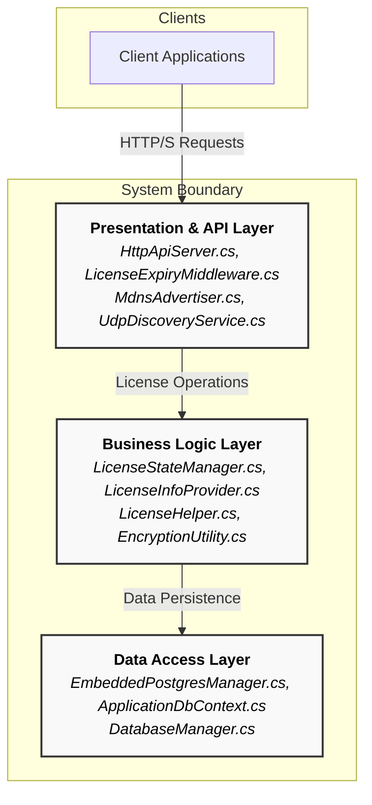
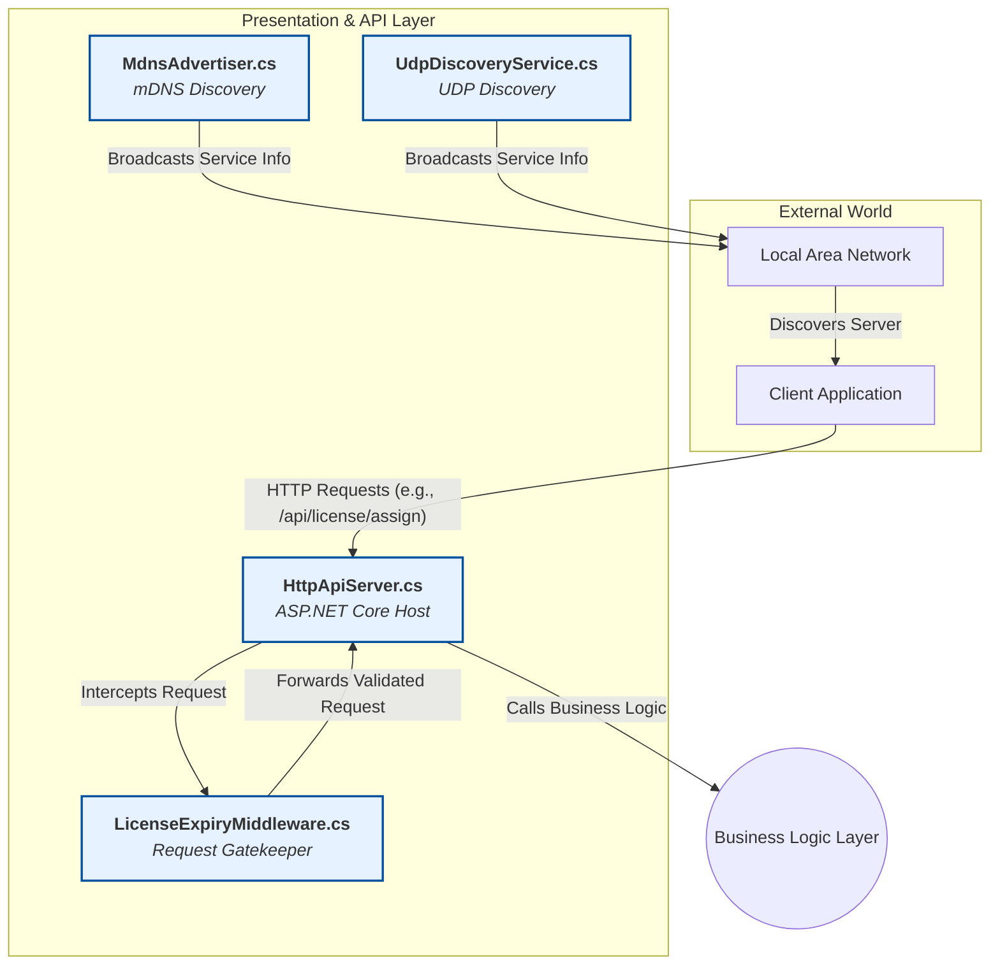
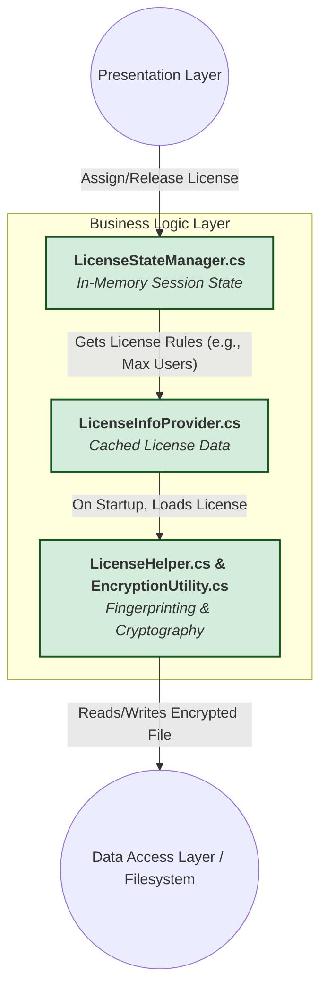
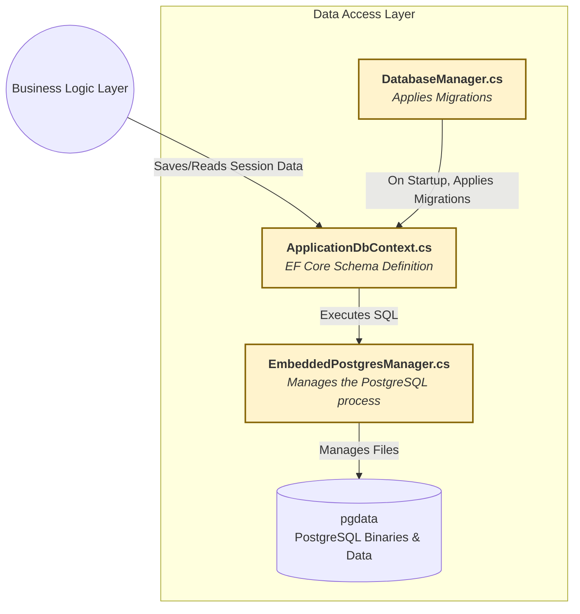
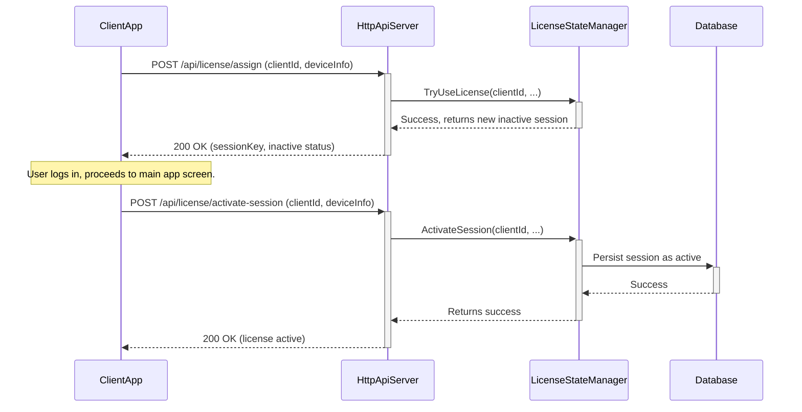
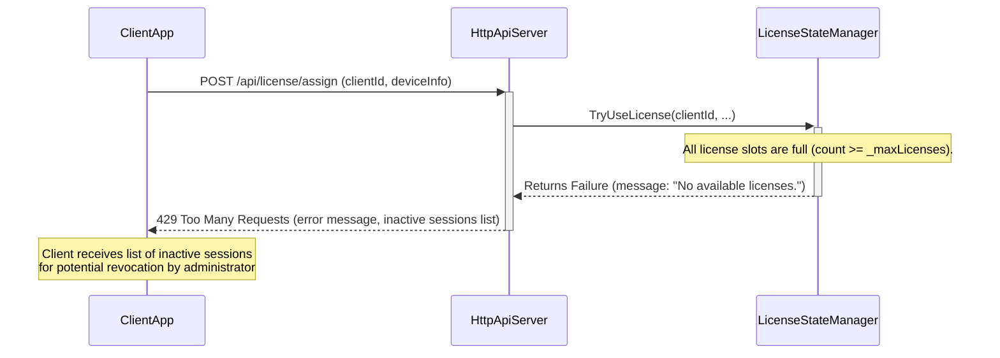

# .NET Centralized DB & License Server: Architectural & Operational Guide

## Executive Summary

**Transform your enterprise software deployment from complex to effortless.** This self-hosted .NET Worker Service revolutionizes license and database management by eliminating the traditional pain points that plague enterprise environments. Instead of wrestling with separate database installations, intricate network configurations, and fragile infrastructure dependencies, you get a single executable that "just works."

**Deploy once, manage everywhere.** The system automatically discovers and connects client applications across your network using mDNS and UDP protocols, while its embedded PostgreSQL database requires zero database administration. Machine-bound license encryption ensures security without sacrificing simplicity. Whether you're rolling out to 5 workstations or 500, the experience remains consistently simple—download, run, and your infrastructure is ready.

**Built for real-world enterprise needs.** Organizations choose this solution when they need enterprise-grade capabilities with startup-level operational simplicity. No more coordinating between database teams, network administrators, and security specialists. The "appliance" model delivers complete database and licensing services through a single binary that handles everything transparently.

## Core Features

- **Self-Contained & Embedded Database:** Runs its own managed instance of PostgreSQL, eliminating external database dependencies.
- **Zero-Configuration Network Discovery:** Implements both `mDNS` (Bonjour) and `UDP` broadcast protocols, allowing clients to locate the server automatically.
- **Secure, Fingerprint-Based Licensing:** Encrypts the license file on disk using a unique device fingerprint, preventing tampering and unauthorized use.
- **Robust Session Management:** Provides real-time tracking of active and inactive license sessions with a thread-safe state manager.
- **Automated Database Schema Management:** Leverages Entity Framework Core Migrations to automatically create and update the database schema on startup.
- **RESTful API for Control:** Exposes a clear set of HTTP endpoints for all license, session, and database provisioning operations.

## Architectural Philosophy & Design Principles

The system architecture is guided by three fundamental principles that directly address the challenges of enterprise software deployment and management in diverse network environments.

### Principle of Self-Containment (The "Appliance" Model)

**Why?** To eliminate external dependencies and simplify deployment for non-technical users. Traditional database-dependent applications require separate database server installation, configuration, and ongoing maintenance by skilled administrators.

**How?** By integrating an embedded database using **`MysticMind.PostgresEmbed`**. This removes the need for a separate database administrator. The `EmbeddedPostgresManager.cs` automatically downloads PostgreSQL binaries (version **17.4.0**) and manages the complete database lifecycle in the `pgdata` directory. The server handles binary acquisition, configuration file generation, process lifecycle management, and network access control modifications—all transparently to the end user.

### Principle of Zero-Configuration Networking

**Why?** To ensure client applications can find and connect to the server on a LAN without manual IP address configuration, DNS setup, or network topology knowledge. This eliminates a major deployment friction point in enterprise environments.

**How?** Through a dual-protocol discovery mechanism that provides redundancy and cross-platform compatibility:

1. **mDNS (Bonjour):** The `MdnsAdvertiser.cs` broadcasts standard service types (`_license-server._tcp.local`, `_postgresql._tcp.local`) using the `Makaretu.Dns` library for seamless cross-platform discovery.
2. **UDP Broadcast:** The `UdpDiscoveryService.cs` provides a fallback mechanism, listening on port **41234** for a specific query string (`DISCOVER_LICENSE_SERVER`) and responding with JSON-formatted service information.

### Principle of Secure by Default & Defense-in-Depth

**Why?** To ensure license integrity and make the license non-transferable between machines, preventing software piracy and unauthorized usage while maintaining user convenience.

**How?** This is achieved through three complementary layers of security:

1. **Device Fingerprinting:** The `LicenseHelper.cs` generates a unique fingerprint from multiple system identifiers (machine name, user SID on Windows, UID on macOS, SMBIOS UUID), cryptographically tying the license to specific hardware.
2. **Robust Encryption:** The `EncryptionUtility.cs` uses this fingerprint to derive a key for **AES-256 (CBC mode, PKCS7 padding)** encryption. The key is derived using `Rfc2898DeriveBytes` (PBKDF2) with **100,000 iterations** and a hardcoded salt, providing resistance against rainbow table and brute-force attacks.
3. **Request Middleware:** The `LicenseExpiryMiddleware.cs` acts as a gatekeeper for all API requests, validating the server's own license validity, expiry status, and detecting potential clock tampering _before_ processing any client requests.

## System Architecture

The system is architected using a three-layer approach that separates concerns and ensures maintainability, scalability, and security.

### 3.1 High-Level Architectural Layers



---

### 3.2 Layer 1: Presentation & API Layer

**Purpose:** This layer is the system's entry point, responsible for handling all external communication, including client requests and network discovery.

**Diagram:**



**Component Breakdown (Enhanced):**

- **`HttpApiServer.cs`:** The primary entry point hosted by `Worker.cs`, using ASP.NET Core Minimal APIs on port **7890**. This component implements the `HttpApiHost` class that manages the complete web server lifecycle, from `WebApplication.CreateBuilder()` initialization through endpoint mapping and graceful shutdown. It coordinates with dependency injection to access `LicenseStateManager`, `LicenseInfoProvider`, and database services, serving as the orchestration layer for all client-server interactions.

- **`LicenseExpiryMiddleware.cs`:** A security control that intercepts requests through ASP.NET Core's middleware pipeline, checking an `excludedPaths` list (`["/api/activate-license", "/api/health", "/db/provision/download", "/db/migrations/run"]`) before validating the server's license for validity, expiry, and clock tampering. The middleware implements sophisticated clock tampering detection by comparing `Environment.TickCount64` values and system timestamps, with automatic license re-synchronization when discrepancies exceed 2 hours or 600 seconds respectively.

- **`MdnsAdvertiser.cs` & `UdpDiscoveryService.cs`:** Background services for network presence advertisement. `MdnsAdvertiser` uses the `Makaretu.Dns` library for standards-compliant mDNS broadcasting with automatic re-advertisement every 60 seconds and service profile management in a `Dictionary<string, ServiceProfile>`. `UdpDiscoveryService` listens on UDP port **41234** for discovery queries, responding with JSON-encoded service information including hostname, IP address, and service ports for both license server and database services.

---

### 3.3 Layer 2: Business Logic Layer

**Purpose:** This layer contains the core rules, state, and security logic of the application. It is completely decoupled from the API and data layers.

**Diagram:**



**Component Breakdown (Enhanced):**

- **`LicenseStateManager.cs`:** The stateful core using a `ConcurrentDictionary<string, LicenseSession>` for thread-safety, where the session key is a **SHA256 hash** generated from normalized client UUID, hostname, and client ID in the `GenerateSessionKey()` method. This component implements sophisticated session lifecycle management with automatic persistence: it saves session state to `session-cache.enc` on application shutdown via the `SaveSessionsToDisk()` method and restores sessions (marked as inactive) on startup through `LoadSessionsFromDisk()`. The class includes a built-in flush mechanism that automatically writes license usage statistics to disk every 10 seconds using the `FlushToDisk()` method.

- **`LicenseInfoProvider.cs`:** A singleton service that loads the encrypted `license.enc` file once at startup via the `LoadLicenseInfo()` method, caching the `LicenseInfo` object in memory to avoid repeated I/O operations. This component serves as the authoritative source for license constraints (maximum users, statement limits, expiry dates) and implements environment-aware file path resolution, distinguishing between "CyphersolDev" and "Cyphersol" folders based on the `DOTNET_ENVIRONMENT` variable for development versus production deployments.

- **`LicenseHelper.cs` & `EncryptionUtility.cs`:** The security heart implementing **AES-256 in CBC mode with PKCS7 padding**, using a key derived via `Rfc2898DeriveBytes` with **100,000 iterations** and a hardcoded salt (`"YourSuperSalt!@#"`). The `LicenseHelper.GetFingerprint()` method constructs a unique machine identifier by concatenating `Environment.MachineName`, `Environment.UserName`, Windows User SID (via `WindowsIdentity.GetCurrent().User.Value`), macOS UID (via P/Invoke to `getuid()`), and SMBIOS system UUID from WMI queries, creating a cryptographically bound license that cannot be transferred between machines.

---

### 3.4 Layer 3: Data Access Layer

**Purpose:** This layer is responsible for all interactions with the database, handling data persistence and schema management.

**Diagram:**



**Component Breakdown (Enhanced):**

- **`EmbeddedPostgresManager.cs`:** Manages the PostgreSQL **v17.4.0** instance through the `MysticMind.PostgresEmbed` library, implementing comprehensive database lifecycle management. The component configures runtime parameters via `serverParams.Add("max_connections", "500")` and `serverParams.Add("listen_addresses", "*")` for LAN accessibility. Critically, its `ConfigurePgAccessControlAsync` method modifies `pg_hba.conf` to add `host all all <subnet> trust` rules for detected local network subnets, enabling seamless client connectivity. The class also handles automatic configuration persistence through `SaveDatabaseConfig()` and `LoadDatabaseConfig()` methods, storing server settings in a JSON configuration file for service restart scenarios.

- **`ApplicationDbContext.cs`:** The EF Core schema definition using the Fluent API in the `OnModelCreating()` method to map business entities with precise database configurations. The context implements comprehensive relationship mapping with `OnDelete(DeleteBehavior.Cascade)` for maintaining referential integrity, table name mapping via `.ToTable("users")`, column name specifications through `.HasColumnName("user_id")`, and constraint definitions including required fields and default values. The context includes `DbSet<>` properties for all entities: `Users`, `Cases`, `Categories`, `Statements`, `Transactions`, and related business objects.

- **`DatabaseManager.cs`:** An abstraction for schema management that encapsulates Entity Framework migrations through dependency injection of `IServiceScopeFactory`. The class implements the `MigrateAsync()` method which calls `db.Database.MigrateAsync()` to apply pending migrations from the `Migrations` folder, with integrated logging and error handling. This component ensures database schema consistency across application versions and handles the critical bootstrap sequence where database availability is verified before migration execution.

## Data & Sequence Flows

The following sequence diagram illustrates the complete process of a client assigning and then activating a license, demonstrating how the three architectural layers interact:



### Failure Path: License Unavailable

The following sequence diagram illustrates the system behavior when all license slots are occupied and a new client attempts to acquire a license:



## Operational Playbook

### Prerequisites

- **.NET 9.0 SDK** - Required for building and running the application ([Download .NET 9.0 SDK](https://dotnet.microsoft.com/en-us/download))
- **Administrative privileges** - Needed for embedded PostgreSQL setup and network service binding
- **Git** - For cloning the repository ([Download here](https://git-scm.com/downloads))
- **Visual Studio Code (Recommended)** - For optimal development experience ([Download here](https://code.visualstudio.com/))

### Complete Setup Guide for New Developers

This step-by-step guide will get you from zero to running in under 10 minutes:

#### Step 1: Install Development Environment

1. **Install .NET 9.0 SDK:**
   ```bash
   # Verify installation
   dotnet --version
   # Should show: 9.0.x
   ```

2. **Install Visual Studio Code:**
   - Download and install VS Code
   - Install the **C# Dev Kit** extension (provides IntelliSense, debugging, and project management)
   - Install the **C#** extension by Microsoft
   - Optional: Install the **REST Client** extension for testing API endpoints

#### Step 2: Clone and Setup Project

```bash
# Clone the repository
git clone <repository-url>
cd MyLanService

# Restore NuGet packages
dotnet restore

# Verify build works
dotnet build
```

#### Step 3: Configure VS Code (Optional but Recommended)

Open the project in VS Code:
```bash
code .
```

VS Code will automatically:
- Detect the .NET project and configure IntelliSense
- Create `.vscode/launch.json` for debugging
- Set up build tasks

#### Step 4: First Run

**Option A - Command Line:**
```bash
dotnet run
```

**Option B - VS Code Debugging:**
1. Press `F5` or go to Run → Start Debugging
2. VS Code will build and launch with debugging enabled
3. Set breakpoints by clicking in the margin next to line numbers

#### Step 5: Verify Everything Works

Once the application starts, you should see console output indicating:

```
✓ HTTP API Server started on port 7890
✓ mDNS advertisement active for _license-server._tcp.local
✓ UDP discovery service listening on port 41234
✓ Embedded PostgreSQL management ready
```

Test the health endpoint:
```bash
# Using curl
curl http://localhost:7890/api/health

# Using PowerShell
Invoke-RestMethod -Uri "http://localhost:7890/api/health"
```

#### Troubleshooting First Run

- **Port 7890 already in use:** Another instance might be running. Check Task Manager/Activity Monitor
- **Permission denied errors:** Run your terminal/VS Code as Administrator (Windows) or with sudo (Mac/Linux)
- **PostgreSQL fails to start:** Ensure no other PostgreSQL instances are running on port 5432

### Deployment Model

The application is designed to run as a **Windows Service** for production deployment. The `Program.cs` file includes the `builder.UseWindowsService()` call which enables Windows Service integration when running on Windows platforms. For other operating systems, it operates as a standard background process or daemon.

**Publishing the Application:**

For Windows:
```bash
dotnet publish -c Release -r win-x64 --self-contained true -p:PublishSingleFile=true -o ./publish
```

For Mac:
```bash
dotnet publish -c Release -r osx-arm64 --self-contained true -p:PublishSingleFile=true -o ./publish
```

**Service Installation Process:**

1. Publish the application using the appropriate command above
2. Install as Windows Service: `sc create "LicenseServer" binPath="C:\path\to\MyLanService.exe"`
3. Configure service startup: `sc config "LicenseServer" start=auto`
4. Start the service: `sc start "LicenseServer"`

The service will automatically start on system boot and manage its embedded PostgreSQL instance throughout the system lifecycle.

### First-Time Provisioning

The following steps must be performed in sequence for initial setup:

1. **Download and Start PostgreSQL:**

   ```bash
   POST /db/provision/download
   ```

2. **Apply Database Migrations:**

   ```bash
   POST /db/migrations/run
   ```

3. **Activate Server License:**
   ```bash
   POST /api/activate-license
   Content-Type: application/json
   {
     "license_key": "your-license-key-here"
   }
   ```

### Common Operational Tasks

#### Manually Revoking a User's License

When all license slots are occupied and you need to free up a slot for a new user, follow this process:

1. **List all current sessions:**
   ```bash
   GET /api/license/sessions
   ```
   
   This returns a JSON array with session details:
   ```json
   [
     {
       "sessionKey": "abc123...",
       "clientId": "user@workstation1",
       "hostname": "WORKSTATION-01",
       "isActive": false,
       "assignedAt": "2024-01-15T09:30:00Z",
       "lastActivityAt": "2024-01-15T11:45:00Z"
     }
   ]
   ```

2. **Identify the session to revoke:**
   - Look for inactive sessions (`"isActive": false`) first
   - Check `lastActivityAt` timestamps to find stale sessions
   - Note the `clientId` and `hostname` for the target session

3. **Revoke the specific license:**
   ```bash
   POST /api/license/release
   Content-Type: application/json
   {
     "clientId": "user@workstation1",
     "hostname": "WORKSTATION-01"
   }
   ```

4. **Verify the license was released:**
   ```bash
   GET /api/license/sessions
   ```
   
   The target session should no longer appear in the list, freeing up a slot for new users.

**Best Practices:**
- Always revoke inactive sessions before active ones
- Communicate with users before revoking active sessions
- Consider the `lastActivityAt` timestamp - sessions idle for > 24 hours are good candidates
- Document which sessions you revoke for audit purposes

## API Endpoint Reference

| Method | Endpoint                             | Description                                                   |
| :----- | :----------------------------------- | :------------------------------------------------------------ |
| `POST` | `/api/activate-license`              | Activates the master license for the entire server.           |
| `POST` | `/api/license/assign`                | Requests a new, inactive license session for a client.        |
| `POST` | `/api/license/activate-session`      | Marks a previously assigned session as active.                |
| `POST` | `/api/license/release`               | Deactivates and releases a client's license session.          |
| `GET`  | `/api/license/sessions`              | Retrieves a list of all active and inactive sessions.         |
| `POST` | `/api/license/use-statement`         | Records the usage of one license statement.                   |
| `GET`  | `/api/license/check-statement-limit` | Checks if the statement usage limit has been reached.         |
| `POST` | `/db/provision/download`             | Downloads PostgreSQL binaries and starts the database server. |
| `POST` | `/db/migrations/run`                 | Applies Entity Framework Core database migrations.            |
| `POST` | `/db/validate`                       | Validates database connectivity with provided credentials.    |
| `GET`  | `/api/health`                        | Returns server health status and basic system information.    |

## Troubleshooting Guide

### Logs

- **Location:** `logs/gateway/gateway_YYYY-MM-DD.txt`
- **Development:** Console output is used instead of file logging
- **Production:** Rolling file logs with 31-day retention and 100MB size limit

Check logs first for any startup issues, license validation problems, or network connectivity errors.

### Database

To connect directly to the embedded PostgreSQL instance for debugging:

```bash
# Default connection parameters
Host: localhost
Port: 5432
Username: postgres
Password: password
Database: postgres
```

Use any PostgreSQL client (pgAdmin, psql, etc.) with these credentials.

### Manual Database Inspection

The physical database files are located in the `pgdata` subdirectory of the application's shared data folder. This location varies by operating system and environment:

**Development Environment:**

- **Windows:** `C:\ProgramData\CyphersolDev\pgdata`
- **macOS:** `/Users/Shared/CyphersolDev/pgdata`
- **Linux:** `/usr/share/CyphersolDev/pgdata`

**Production Environment:**

- **Windows:** `C:\ProgramData\Cyphersol\pgdata`
- **macOS:** `/Users/Shared/Cyphersol/pgdata`
- **Linux:** `/usr/share/Cyphersol/pgdata`

This location is critical for manual backups, data recovery operations, and troubleshooting database corruption issues. The directory contains the complete PostgreSQL data cluster including configuration files (`postgresql.conf`, `pg_hba.conf`), transaction logs, and table data files.

### Firewall

Ensure the following ports are accessible:

- **Port 7890** - HTTP API Server (TCP)
- **Port 5432** - PostgreSQL Database (TCP)
- **Port 41234** - UDP Discovery Service (UDP)
- **Port 5353** - mDNS/Bonjour (UDP)

Test firewall configuration using the built-in endpoints:

```bash
POST /db/test/firewall
POST /db/test/network
```

### Common Issues

1. **"License not found" errors:** Ensure `/api/activate-license` has been called successfully
2. **Database connection failures:** Verify PostgreSQL is running via `/db/provision/download`
3. **Network discovery not working:** Check firewall settings and ensure mDNS is enabled on the network
4. **License tampering errors:** Indicates the license file has been moved between machines or corrupted

---

_This documentation serves as the definitive guide for maintaining and extending the .NET Centralized DB & License Server. For additional support, consult the application logs and verify all prerequisites are met._
