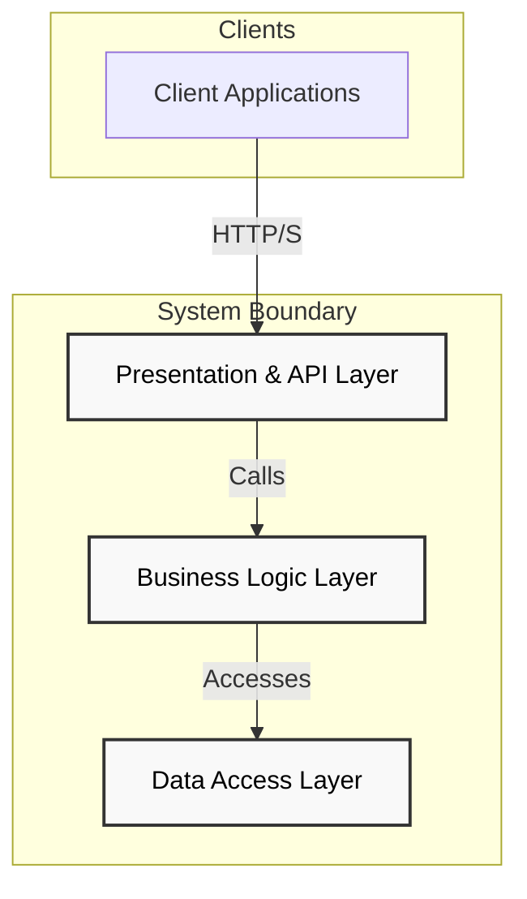
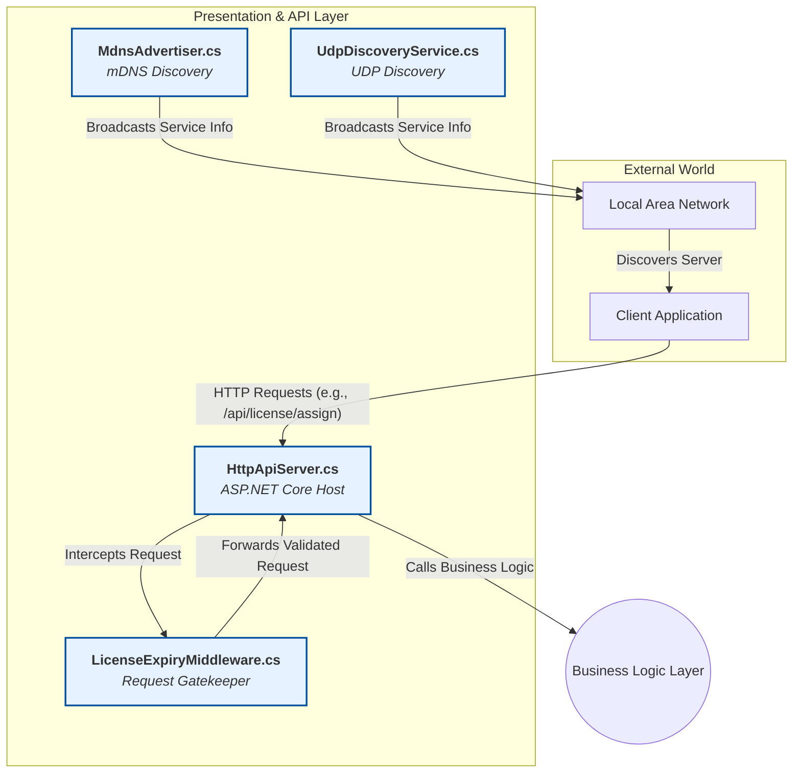
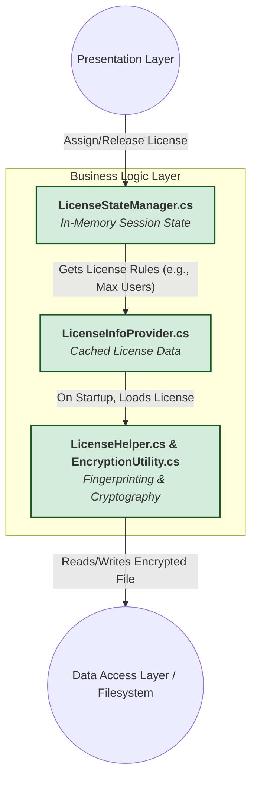
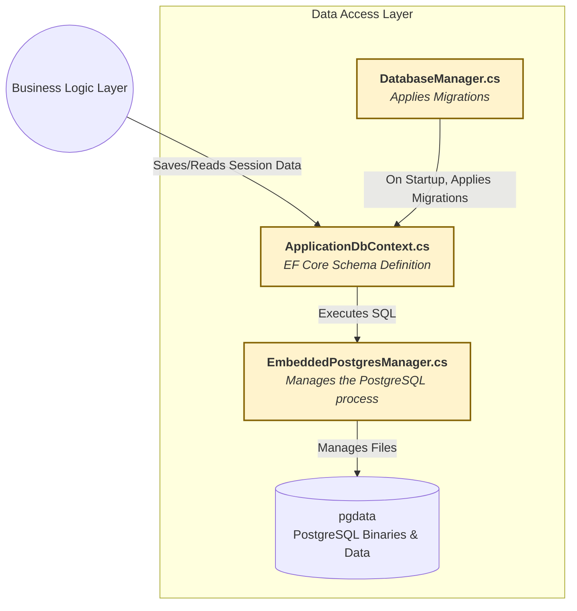
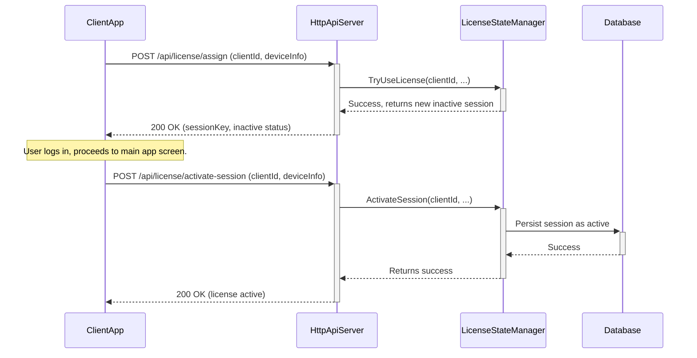

# .NET Centralized DB & License Server

A self-hosted .NET service providing centralized license and database management for client applications on a local network. This enterprise-grade solution features embedded PostgreSQL, zero-configuration network discovery, and robust fingerprint-based license encryption, designed for on-premise deployment with minimal setup requirements.

## Core Features

- **Self-Contained & Embedded Database:** Runs its own managed instance of PostgreSQL, eliminating external database dependencies.
- **Zero-Configuration Network Discovery:** Implements both `mDNS` (Bonjour) and `UDP` broadcast protocols, allowing clients to locate the server automatically.
- **Secure, Fingerprint-Based Licensing:** Encrypts the license file on disk using a unique device fingerprint, preventing tampering and unauthorized use.
- **Robust Session Management:** Provides real-time tracking of active and inactive license sessions with a thread-safe state manager.
- **Automated Database Schema Management:** Leverages Entity Framework Core Migrations to automatically create and update the database schema on startup.
- **RESTful API for Control:** Exposes a clear set of HTTP endpoints for all license, session, and database provisioning operations.

## System Architecture

The system is architected using a three-layer approach that separates concerns and ensures maintainability, scalability, and security.

### 3.1 High-Level Architectural Layers



---

### 3.2 Layer 1: Presentation & API Layer

**Purpose:** This layer is the system's entry point, responsible for handling all external communication, including client requests and network discovery.

**Diagram:**



**Component Breakdown:**

- **HttpApiServer.cs:** Acts as the primary interface for clients, utilizing ASP.NET Core to host a web server that defines all RESTful endpoints (e.g., `/api/license`, `/db/provision`). This component is initialized and managed by `Worker.cs` and serves as the main communication gateway for all client interactions. It handles HTTP requests on port 7890 and coordinates with other system components to process license assignments, session management, and database operations.

- **LicenseExpiryMiddleware.cs:** Functions as a critical security gatekeeper that intercepts all incoming HTTP requests to validate the server's own license before processing client requests. This middleware performs comprehensive checks including license validity, expiry validation, and clock tampering detection. It maintains a list of excluded endpoints (like `/api/activate-license`, `/api/health`) that bypass license validation, ensuring system bootstrapping can occur without circular dependencies.

- **MdnsAdvertiser.cs & UdpDiscoveryService.cs:** These services implement the "zero-configuration" networking magic that makes the server discoverable on the local network. `MdnsAdvertiser` broadcasts a `_license-server._tcp.local` service using the Bonjour protocol, while `UdpDiscoveryService` listens for and responds to specific UDP broadcast queries (`DISCOVER_LICENSE_SERVER`) on port 41234. This dual approach ensures compatibility across different network environments and client discovery mechanisms.

---

### 3.3 Layer 2: Business Logic Layer

**Purpose:** This layer contains the core rules, state, and security logic of the application. It is completely decoupled from the API and data layers.

**Diagram:**



**Component Breakdown:**

- **LicenseStateManager.cs:** Serves as the "brain" of the license operation, managing a thread-safe `ConcurrentDictionary<string, LicenseSession>` that tracks all active and inactive license sessions. This component enforces the maximum user limit configured in the license, implements session lifecycle management through methods like `TryUseLicense`, `ReleaseLicense`, and `ActivateSession`, and handles statement usage counting with automatic disk flushing every 10 seconds. Each session is identified by a SHA-256 hash generated from the client's UUID, hostname, and client ID, ensuring session uniqueness and security.

- **LicenseInfoProvider.cs:** Functions as a singleton service that loads and caches the master `LicenseInfo` object from the encrypted file at application startup. It acts as a read-only cache for license rules and constraints, providing the rest of the application with access to license limits, expiry dates, and usage quotas. This component handles license information validation and maintains the relationship between the encrypted on-disk representation and the in-memory business objects.

- **LicenseHelper.cs & EncryptionUtility.cs:** These components form the security backbone of the system. `LicenseHelper` generates a unique machine fingerprint using system-specific identifiers (machine name, user SID on Windows, UID on macOS, system UUID from SMBIOS) that creates a machine-bound encryption key. `EncryptionUtility` uses this fingerprint with AES-256 encryption in CBC mode, utilizing PBKDF2 with 100,000 iterations for key derivation, ensuring that license files cannot be copied to another machine or tampered with.

---

### 3.4 Layer 3: Data Access Layer

**Purpose:** This layer is responsible for all interactions with the database, handling data persistence and schema management.

**Diagram:**



**Component Breakdown:**

- **EmbeddedPostgresManager.cs:** This sophisticated component downloads, installs, and manages a complete PostgreSQL server instance (version 17.4.0) that runs embedded within the application process. It handles automatic PostgreSQL binary acquisition using the MysticMind.PostgresEmbed library, configures server parameters (max_connections=500, listen_addresses=\*), and critically implements `ConfigurePgAccessControlAsync` which modifies `pg_hba.conf` to allow LAN access by adding trust rules for local network subnets. This component also manages mDNS advertisement of the database service for network discovery.

- **ApplicationDbContext.cs:** Defines the Entity Framework Core representation of the database schema, mapping business entities like `User`, `Case`, `Statement`, and `Transaction` to their corresponding PostgreSQL tables. This component establishes relationships between entities using foreign keys and implements proper cascade deletion behavior. It serves as the ORM layer that translates .NET objects to SQL queries and manages database connections through the connection string provided by `EmbeddedPostgresManager`.

- **DatabaseManager.cs:** Provides a simple but vital service that ensures database schema consistency. On application startup, it executes `db.Database.MigrateAsync()` to apply any pending Entity Framework Core migrations found in the `Migrations` folder. This automated approach ensures that database schema updates are applied seamlessly during application deployment and upgrades, maintaining data integrity across different versions.

## Data & Sequence Flows

The following sequence diagram illustrates the complete process of a client assigning and then activating a license, demonstrating how the three architectural layers interact:



## Setup and Operation

### Prerequisites

- **.NET 9.0 SDK** - Required for building and running the application
- **Administrative privileges** - Needed for embedded PostgreSQL setup and network service binding

### Installation

```bash
git clone <repository-url>
cd License-Server
dotnet restore
```

### Running Locally

```bash
dotnet run
```

The application uses configuration from `Properties/launchSettings.json` and will start:

- HTTP API Server on port **7890**
- mDNS advertisement for `_license-server._tcp.local`
- UDP discovery service on port **41234**

### First-Time Provisioning

The following steps must be performed in sequence for initial setup:

1. **Download and Start PostgreSQL:**

   ```bash
   POST /db/provision/download
   ```

2. **Apply Database Migrations:**

   ```bash
   POST /db/migrations/run
   ```

3. **Activate Server License:**
   ```bash
   POST /api/activate-license
   Content-Type: application/json
   {
     "license_key": "your-license-key-here"
   }
   ```

## API Endpoint Reference

| Method | Endpoint                             | Description                                                   |
| :----- | :----------------------------------- | :------------------------------------------------------------ |
| `POST` | `/api/activate-license`              | Activates the master license for the entire server.           |
| `POST` | `/api/license/assign`                | Requests a new, inactive license session for a client.        |
| `POST` | `/api/license/activate-session`      | Marks a previously assigned session as active.                |
| `POST` | `/api/license/release`               | Deactivates and releases a client's license session.          |
| `GET`  | `/api/license/sessions`              | Retrieves a list of all active and inactive sessions.         |
| `POST` | `/api/license/use-statement`         | Records the usage of one license statement.                   |
| `GET`  | `/api/license/check-statement-limit` | Checks if the statement usage limit has been reached.         |
| `POST` | `/db/provision/download`             | Downloads PostgreSQL binaries and starts the database server. |
| `POST` | `/db/migrations/run`                 | Applies Entity Framework Core database migrations.            |
| `POST` | `/db/validate`                       | Validates database connectivity with provided credentials.    |
| `GET`  | `/api/health`                        | Returns server health status and basic system information.    |

## Troubleshooting Guide

### Logs

- **Location:** `logs/gateway/gateway_YYYY-MM-DD.txt`
- **Development:** Console output is used instead of file logging
- **Production:** Rolling file logs with 31-day retention and 100MB size limit

Check logs first for any startup issues, license validation problems, or network connectivity errors.

### Database

To connect directly to the embedded PostgreSQL instance for debugging:

```bash
# Default connection parameters
Host: localhost
Port: 5432
Username: postgres
Password: password
Database: postgres
```

Use any PostgreSQL client (pgAdmin, psql, etc.) with these credentials.

### Firewall

Ensure the following ports are accessible:

- **Port 7890** - HTTP API Server (TCP)
- **Port 5432** - PostgreSQL Database (TCP)
- **Port 41234** - UDP Discovery Service (UDP)
- **Port 5353** - mDNS/Bonjour (UDP)

Test firewall configuration using the built-in endpoints:

```bash
POST /db/test/firewall
POST /db/test/network
```

### Common Issues

1. **"License not found" errors:** Ensure `/api/activate-license` has been called successfully
2. **Database connection failures:** Verify PostgreSQL is running via `/db/provision/download`
3. **Network discovery not working:** Check firewall settings and ensure mDNS is enabled on the network
4. **License tampering errors:** Indicates the license file has been moved between machines or corrupted

---

_This documentation serves as the definitive guide for maintaining and extending the .NET Centralized DB & License Server. For additional support, consult the application logs and verify all prerequisites are met._
